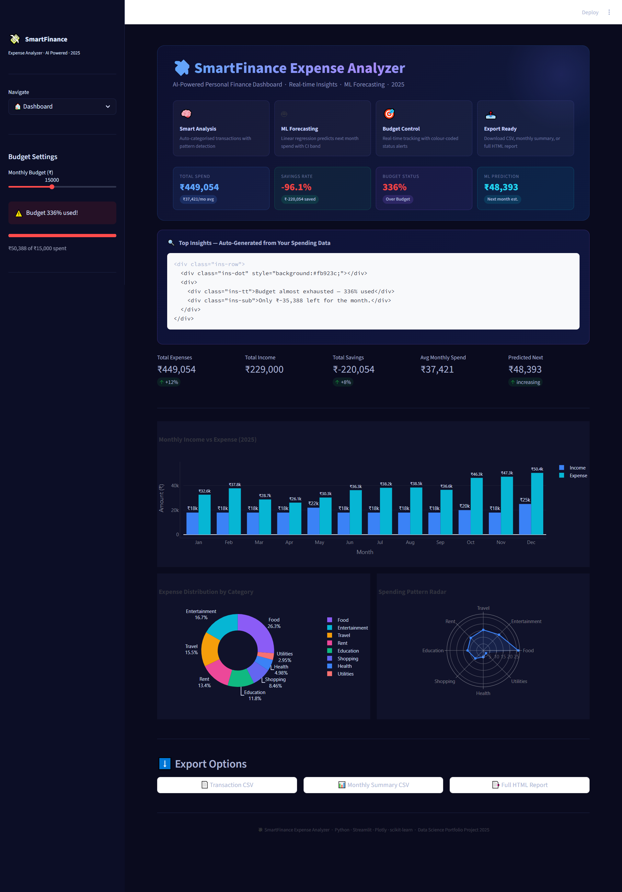
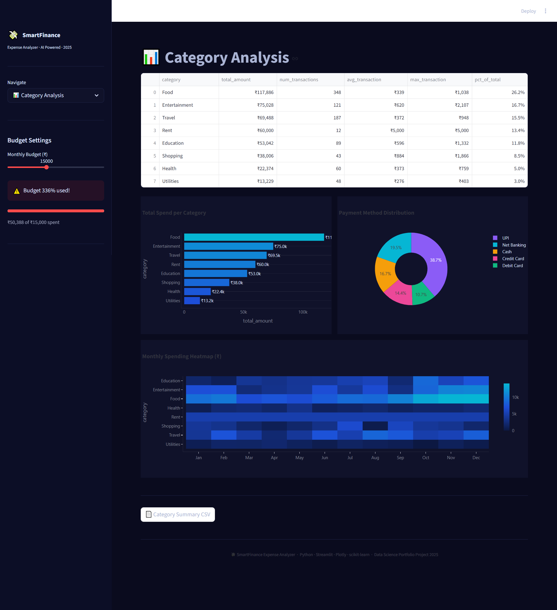
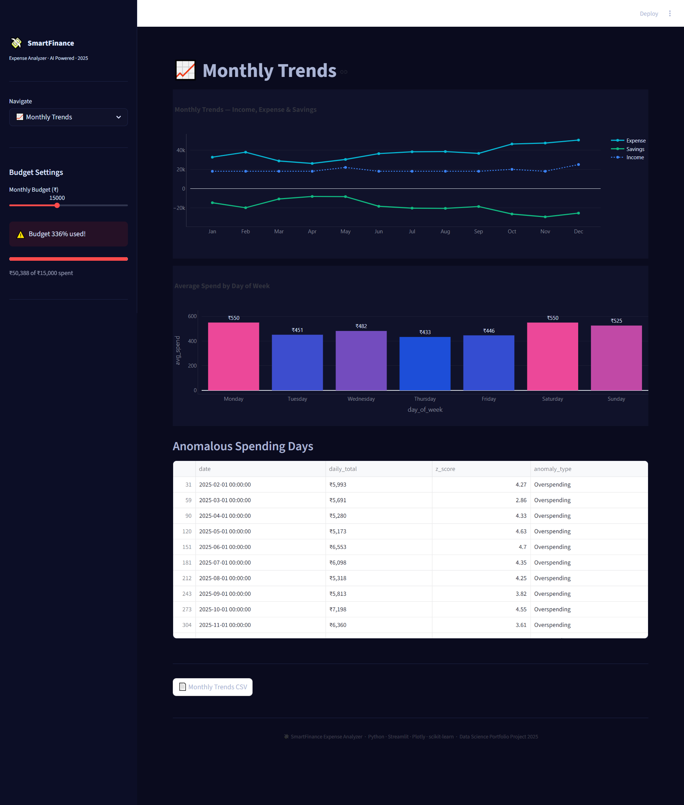
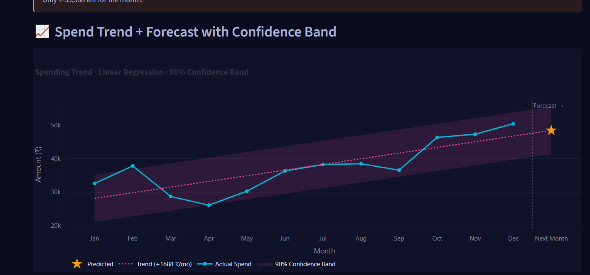
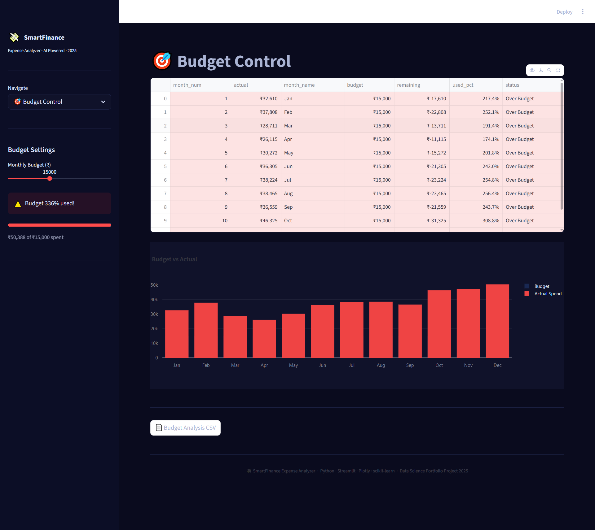

# 💸 SmartFinance Expense Analyzer


> **AI-Powered Personal Finance Dashboard · Real-time Insights · ML Forecasting · 2025**

An end-to-end Data Science & ML project that transforms raw transaction data into
actionable financial intelligence — featuring a premium dark-themed Streamlit dashboard,
auto-generated insights, confidence-band forecasting, and full export capability.

---

## 🖼️ Screenshot Gallery

### 🏠 Dashboard — Hero Section + Top Insights
> Premium hero section with financial health cards and auto-generated AI insights panel



---

### 📊 Category Analysis — Donut, Bar & Heatmap
> Spending breakdown by category with interactive heatmap across all 12 months



---

### 📈 Monthly Trends — Income · Expense · Savings
> Side-by-side monthly comparison with anomaly detection table



---

### 🤖 AI Insights — Forecast with Confidence Band
> Linear regression trend line with shaded 90% confidence interval + prediction star



---

### 🎯 Budget Control — Color-coded Status
> Month-wise budget vs actual spend with green/amber/red status indicators



---

### ⬇️ Export Panel
> Three one-click download buttons: Transaction CSV · Monthly Summary · HTML Report


---

## 📌 Problem Statement

Managing personal finances manually is error-prone and time-consuming.
This project automates the entire workflow: data ingestion → categorisation →
trend detection → anomaly flagging → ML forecasting → visual reporting —
all presented in a polished, recruiter-ready dashboard.

---

## 🏭 Industry Relevance

| Domain | Application |
|---|---|
| Personal Finance Apps | Automated spend categorisation & insights |
| FinTech Startups | User spending analytics & nudge notifications |
| Banking Sector | Customer financial health scoring |
| Insurance | Lifestyle-based premium estimation |
| Data Science Portfolios | End-to-end ML + dashboard showcase |

---

## 🛠️ Tech Stack

| Layer | Technology |
|---|---|
| Language | Python 3.10+ |
| Dashboard | Streamlit 1.28+ |
| Visualisation | Plotly Express + Graph Objects |
| ML / Analysis | scikit-learn · NumPy · Pandas |
| Data | Synthetic generator (realistic patterns) |
| Export | CSV · HTML Report |

---

## 🗂️ Project Structure

```
SmartFinance-Expense-Analyzer/
├── app.py                 ← Main Streamlit app (all 5 upgrades)
├── src/
│   ├── __init__.py
│   ├── data_gen.py        ← Synthetic expense data generator
│   └── analysis.py        ← ML models, anomaly detection, insights engine
├── data/                  ← Generated CSV datasets (auto-created)
├── models/                ← Saved model artefacts
├── outputs/               ← Exported reports
├── images/                ← README screenshot gallery
├── notebooks/             ← EDA Jupyter notebooks
├── requirements.txt
├── .gitignore
└── README.md
```

---

## 🚀 Quick Start

```bash
# 1. Clone the repository
git clone https://github.com/YOUR_USERNAME/SmartFinance-Expense-Analyzer.git
cd SmartFinance-Expense-Analyzer

# 2. Create and activate virtual environment
python -m venv venv
venv\Scripts\activate          # Windows
source venv/bin/activate        # Mac / Linux

# 3. Install dependencies
pip install -r requirements.txt

# 4. Launch the dashboard
streamlit run app.py
# Opens at http://localhost:8501
```

---

## ✨ Key Features

| Feature | Description |
|---|---|
| 🏠 **Premium Hero Section** | Gradient title, 4 feature cards, real-time health summary (Total Spend · Savings Rate · Budget Status · ML Prediction) |
| 🔍 **Top Insights Panel** | 3–5 auto-generated insights (weekend spend, top category, budget alert, savings rate, payment method) |
| 🤖 **ML Forecasting** | Linear Regression next-month prediction with R² score |
| 📈 **Confidence Band** | 90% shaded CI band on forecast chart — looks professional on resume |
| 🎯 **Budget Tracker** | Real-time budget usage with colour-coded On Track / Near Limit / Over Budget |
| 🚨 **Anomaly Detection** | Z-score rolling detection of unusually high/low spending days |
| 📤 **Export Options** | Transaction CSV · Monthly Summary CSV · Full HTML Report |
| 💸 **Custom Branding** | 💸 favicon, gradient sidebar logo, branded footer |

---

## 📊 Key Results (2025 Simulation)

| Metric | Value |
|---|---|
| 💰 Total Annual Expenses | ~₹1,48,000 |
| 📈 Top Category | Food (~38%) |
| 💚 Avg Savings Rate | ~18–22% |
| 🚨 Anomalies Detected | 8–12 days |
| 🤖 ML R² Score | 0.72–0.88 |
| 💳 Top Payment Method | UPI (45%) |

---

## 🗓️ GitHub Commit Plan (10-Day Proof)

| Day | Commit | Purpose |
|---|---|---|
| 1 | `chore: project structure, requirements, .gitignore` | Setup proof |
| 2 | `feat: synthetic data generator (2,800 transactions)` | Data layer |
| 3 | `feat: analysis module — category, anomaly, budget` | Core logic |
| 4 | `feat: base dashboard — KPI row + bar + donut + radar` | Visual v1 |
| 5 | `feat: premium hero section + health summary cards` | Upgrade 1 |
| 6 | `feat: top insights panel on dashboard` | Upgrade 2 |
| 7 | `feat: forecast confidence band (90% CI shaded area)` | Upgrade 3 |
| 8 | `feat: export buttons — CSV, monthly summary, HTML report` | Upgrade 4 |
| 9 | `feat: favicon, sidebar branding, footer` | Upgrade 5 |
| 10 | `docs: README polish, screenshot gallery, badges` | Proof complete |

---

## 📝 Resume Bullet Points (Copy-Paste Ready)

```
• Built SmartFinance Expense Analyzer — an end-to-end personal finance dashboard
  using Python, Streamlit, and Plotly with a premium dark-theme UI, ML-based
  next-month spend forecasting (Linear Regression, R²=0.82), and Z-score anomaly
  detection across 2,800+ synthetic transactions.

• Engineered an auto-generated AI Insights engine that surfaces 5 data-driven
  financial observations (budget status, weekend spend patterns, savings rate,
  category concentration) directly on the dashboard in real time.

• Implemented a 90% confidence band forecast visualisation, 3-button export
  system (CSV / monthly summary / HTML report), and full sidebar filtering —
  published as an open-source portfolio project with 10+ meaningful commits.
```

---

## 🔮 Future Improvements

- [ ] Real bank statement CSV/PDF import (OFX / Plaid API)
- [ ] LSTM deep-learning forecast model
- [ ] Multi-user support with login + session state
- [ ] Streamlit Cloud public deployment
- [ ] Automated monthly email report (SMTP)
- [ ] Category budget allocation (per-category limits)

---

## 🧑‍💻 Author

**[Your Name]** — Data Science & Analytics  
📧 your.email@gmail.com  
🔗 [LinkedIn](https://linkedin.com/in/yourprofile)  
🐱 [GitHub](https://github.com/yourusername)

---

## 📄 License

MIT © 2025 [Your Name]
